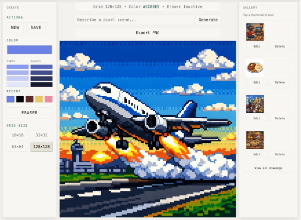
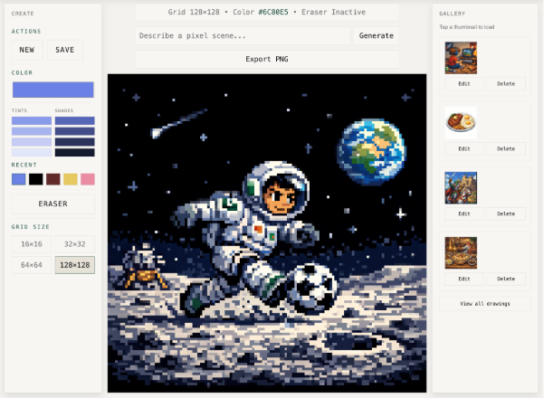

# TinyDots

TinyDots is a pixel art playground built with ASP.NET Core. It lets you draw, save, and generate pixel art, then export it as a PNG.

<div style="display:flex; gap:16px;">
  
  
</div>

## Features

- Pixel grid editor with color tools and eraser
- Save/edit/delete drawings
- AI image generation for pixel art prompts
- Export drawings as PNG

## Requirements

- .NET SDK (check `TinyDots.csproj` for the target version)

## Getting Started

1. Restore and run the app:
   ```bash
   dotnet run
   ```
2. Open the app:
   ```
   http://localhost:xxxx
   ```

## Environment Variables

Set your OpenAI API key for AI image generation:

```bash
export OPENAI_API_KEY="your_key_here"
```

If you launch from an IDE, add the variable to `Properties/launchSettings.json` under `environmentVariables`.

## Notes

- Generated images are fitted to the selected grid size.
- PNG export is scaled to 720x720 for crisp output.

## Project Structure

- `Controllers/` MVC controllers
- `Models/` Entity and request models
- `Views/` Razor views
- `wwwroot/` Static assets (JS/CSS)
