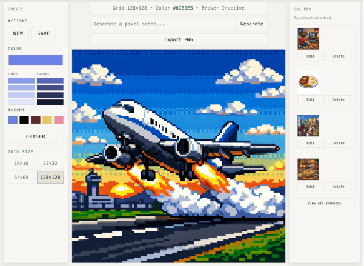
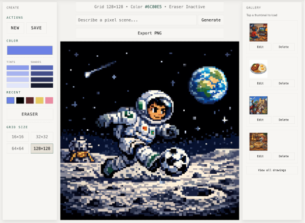

# TinyDots

TinyDots is a pixel art playground built with ASP.NET Core. Draw on a grid canvas, save your work to a personal gallery, generate art from text prompts using AI, and export your drawings as high-resolution PNGs.

<div style="display:flex; gap:16px;">
  
  
</div>

## Features

- **Grid editor** — switchable canvas sizes: 16×16, 32×32, 64×64, 128×128
- **Color tools** — color picker with automatic tint/shade generation, eraser, and color history (last 5 used colors, persisted in localStorage)
- **Personal gallery** — save, edit, and delete drawings; thumbnails shown in a sidebar panel
- **AI image generation** — describe pixel art in plain text and generate it via the OpenAI API
- **PNG export** — drawings exported at 720×720 for crisp, upscaled output
- **User accounts** — register and log in; each user's drawings are stored separately

## Tech Stack

| Layer | Technology |
|---|---|
| Backend | ASP.NET Core 8 (MVC) |
| Database | MySQL via Entity Framework Core (Pomelo) |
| Auth | ASP.NET Core Identity |
| Frontend | Vanilla JS + HTML5 Canvas + CSS |
| AI | OpenAI API (`gpt-image-1.5`) |

## Requirements

- [.NET 8 SDK](https://dotnet.microsoft.com/download)
- MySQL server (default: `localhost:3306`)
- OpenAI API key (optional — only needed for AI image generation)

## Getting Started

**1. Configure the database**

The default connection string in `appsettings.json` points to:

```
server=localhost;port=3306;database=TinyDotsDb;user=root;password=1234567;
```

Update those values to match your MySQL setup before running.

**2. Set your OpenAI API key** (optional)

```bash
export OPENAI_API_KEY="your_key_here"
```

If you launch from an IDE, add it under `environmentVariables` in `Properties/launchSettings.json`.

**3. Run the app**

```bash
cd TinyDots
dotnet run
```

The app applies EF Core migrations automatically on first run and opens at:

- HTTP: `http://localhost:5043`
- HTTPS: `https://localhost:7220`

## Project Structure

```
TinyDots/
├── Controllers/
│   ├── DrawingsController.cs   # Save, delete, generate image endpoints
│   └── HomeController.cs       # Landing page
├── Models/
│   ├── Drawing.cs              # Drawing entity
│   ├── ApplicationUser.cs      # Identity user
│   ├── SaveDrawingRequest.cs   # DTO for save
│   └── GenerateImageRequest.cs # DTO for AI generation
├── Data/
│   └── AppDbContext.cs         # EF Core context
├── Views/
│   ├── Drawings/               # Editor, gallery, edit, delete views
│   └── Shared/                 # Layout and login partial
├── wwwroot/
│   ├── js/pixel-app.js         # Main editor logic (~850 lines)
│   └── css/pixel-app.css       # Main styles
├── Migrations/                 # EF Core migration files
└── Program.cs                  # App bootstrap and service config
```

## API Endpoints

| Method | Path | Description |
|---|---|---|
| `GET` | `/Drawings` | Main editor with gallery |
| `POST` | `/Drawings` | Create a new drawing |
| `PUT` | `/Drawings/{id}` | Update an existing drawing |
| `DELETE` | `/Drawings/{id}` | Delete a drawing |
| `POST` | `/Drawings/GenerateImage` | Generate pixel art from a text prompt |

## Notes

- Generated images are fitted to the selected grid size.
- PNG export scales to 720×720 for crisp output regardless of grid size.
- Color history is stored in the browser's localStorage.
